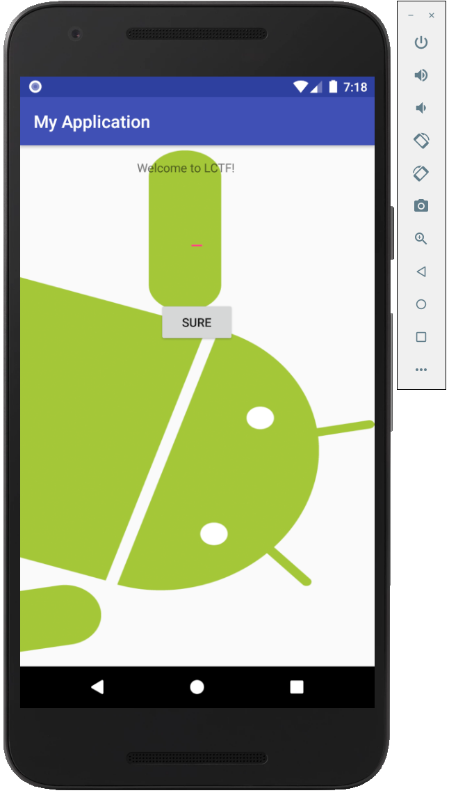

## 描述

题目来源：L-CTF

[easy100.apk.515049fd54a763e929a8d6cb0034f249](./assets/easy100.apk.515049fd54a763e929a8d6cb0034f249)

## 题解

用虚拟机装一下，跑一下是这玩意



猜密码。

所以应该要反编译去分析代码了。折腾了一下本地反编译，不想装那啥 `dex2jar`，感觉搜到的文章全是国人在装，直接 google `apk reverse source code`，第一个网站是在线反编译，正合我意。

http://www.javadecompilers.com

得到源码后，根据界面的文字 `SURE` 在资源文件里先搜索其变量名 `grep -r -i "sure" *` 

```xml
<Button android:id="@+id/sureButton" android:layout_width="wrap_content" android:layout_height="wrap_content" android:layout_marginTop="57dp" android:text="Sure" android:layout_below="@+id/passCode" android:layout_centerHorizontal="true"/>
```

再搜索 `sureButton`

```
$ grep -r -i "sureButton"
com/example/ring/myapplication/C1582e.java:        public static final int sureButton = 2131427413;
com/example/ring/myapplication/MainActivity.java:        ((Button) findViewById(R.id.sureButton)).setOnClickListener(new C1581d(this));
com/example/ring/myapplication/R.java:        public static final int sureButton = 2131427413;
```

找到 `MainActivity.java`，然后看了那几个反编译代码十分钟，稍微理清了思路：

先用这段代码计算出一个常量

```java
try {
    InputStream open = getResources().getAssets().open("url.png");
    int available = open.available();
    byte[] bArr = new byte[available];
    open.read(bArr, 0, available);
    byte[] bArr2 = new byte[16];
    System.arraycopy(bArr, 144, bArr2, 0, 16);
    String f4674v = new String(bArr2, "utf-8");
} catch (Exception e) {
    e.printStackTrace();
}
```

当输入一个密码（假设为 `password` 字符串变量）并确认时，若 `m8939a(f4674v, pass)` 为 true 则成功，自己整理了一些其调用函数的关系，去掉了所有的类、对象的关系：

```java
public boolean m8939a(String str, String str2) {
    return mo5766a(str, str2).equals(new String(new byte[]{21, -93, -68, -94, 86, 117, -19, -68, -92, 33, 50, 118, 16, 13, 1, -15, -13, 3, 4, 103, -18, 81, 30, 68, 54, -93, 44, -23, 93, 98, 5, 59}));
}

public String mo5766a(String str, String str2) {
    try {
        String a = m8943a(str);
        SecretKeySpec f4675a = new SecretKeySpec(a.getBytes(), "AES");
        Cipher f4676b = Cipher.getInstance("AES/ECB/PKCS5Padding");
        f4676b.init(1, f4675a);
        return new String(f4676b.doFinal(str2.getBytes()), "utf-8");
    } catch (Exception e) {
        e.printStackTrace();
        return new String();
    }
}

public String m8943a(String str) {
    try {
        str.getBytes("utf-8");
        StringBuilder sb = new StringBuilder();
        for (int i = 0; i < str.length(); i += 2) {
            sb.append(str.charAt(i + 1));
            sb.append(str.charAt(i));
        }
        return sb.toString();
    } catch (Exception e) {
        e.printStackTrace();
        return new String();
    }
}
```

发现了 AES 这个东西，这个是对称密码，所以猜测那一大堆数字就是加密后的密码，秘钥是那个图片 `url.png` 的数据经过了一些操作得到的。

那么可以轻易写出一段 Java 代码来解密：

```java
import java.io.File;
import java.io.FileInputStream;
import java.io.InputStream;
import javax.crypto.Cipher;
import javax.crypto.NoSuchPaddingException;
import javax.crypto.spec.SecretKeySpec;

public class Main {
    public static void main(String[] args) {
        try {
            InputStream open = new FileInputStream(new File("./url.png"));
            int available = open.available();
            byte[] bArr = new byte[available];
            open.read(bArr, 0, available);
            byte[] bArr2 = new byte[16];
            System.arraycopy(bArr, 144, bArr2, 0, 16);
            String f4674v = new String(bArr2, "utf-8");
            // !!!! Note: DO NOT CONVERT byte[] TO String THEN CONVERT BACK!!!!
            // !!!! new String(theBytes).getBytes() and theBytes are not equal!!!!
            String answer = mo5766a(f4674v, new byte[]{21, -93, -68, -94, 86, 117, -19, -68, -92, 33, 50, 118, 16, 13, 1, -15, -13, 3, 4, 103, -18, 81, 30, 68, 54, -93, 44, -23, 93, 98, 5, 59});
            System.out.println(answer);
        } catch (Exception e) {
        }
    }

    static public String mo5766a(String str, byte[] bArr) {
        try {
            String a = m8943a(str);
            SecretKeySpec f4675a = new SecretKeySpec(a.getBytes(), "AES");
            Cipher f4676b = Cipher.getInstance("AES/ECB/PKCS5Padding");
            f4676b.init(Cipher.DECRYPT_MODE, f4675a);
            return new String(f4676b.doFinal(bArr), "utf-8");
        } catch (Exception e) {
            return new String();
        }
    }

    static public String m8943a(String str) {
        try {
            str.getBytes("utf-8");
            StringBuilder sb = new StringBuilder();
            for (int i = 0; i < str.length(); i += 2) {
                sb.append(str.charAt(i + 1));
                sb.append(str.charAt(i));
            }
            return sb.toString();
        } catch (Exception e) {
            return new String();
        }
    }
}
```

有一个坑是，别用 `res/drawable/` 文件夹的下的 `url.png` ！！！！！原图片在 `assets/` 文件夹里！

md，然后我还踩了一个 Java 的坑，不能把 `byte[]` 转换成 `String` 再转回来，不会相等的！！！因为转成 `String` 的时候，会编码（比如 `utf-8`），不符合编码的数据会替换成别的！！！！

所以在 `String mo5766a(String str, byte[] bArr)` 这个函数里我传数组罢了！

之后看了题解，和我做法一致，但是别人是用 Python 写的，我凑。

## 答案

LCTF{1t's_rea1ly_an_ea3y_ap4}
